# SNP Analysis Tutorial

## Overview

The **snpstats** jamovi module provides a complete pipeline for single-SNP and multi-SNP genetic association analyses. It covers descriptive statistics (genotype and allele frequencies, Hardy–Weinberg equilibrium), single-SNP association under five genetic models, SNP × covariate interaction testing with stratified and cross-classification tables, linkage disequilibrium analysis, and haplotype frequency estimation, association, and interaction testing.

---

## Data format

Each row in the dataset represents one individual. SNP genotypes must be stored as character columns using diploid notation — two alleles separated by a delimiter, or concatenated as two characters. The module accepts the following formats:

| Format | Separator          | Example values   |
| ------ | ------------------ | ---------------- |
| A/B    | slash `/`        | T/T, T/C, C/C    |
| A\|B   | pipe `\|`         | T\|T, T\|C, C\|C |
| A>B    | greater-than `>` | T>T, T>C, C>C    |
| AB     | none (2 chars)     | TT, TC, CC       |

Any allele names are accepted (single nucleotides, insertion/deletion codes, etc.), provided that exactly two distinct alleles appear across the column. Columns with three or more alleles, or inconsistent genotype combinations (e.g. A/A, A/C, B/C) are flagged and excluded with an informative message.

The **response variable** should be a binary (case/control coded 0/1 or as a two-level factor) or continuous column. **Covariates** can be numeric or categorical.

---

## SNP Descriptive module

The **SNP Descriptive** module (Figure 1) is the starting point for any analysis. Assign the response variable, one or more SNPs, and any covariates in the variable assignment panel. The **Response type** dropdown defaults to *Auto-detect*, which selects logistic regression for binary outcomes and linear regression for continuous outcomes; override it when automatic detection produces unexpected results.

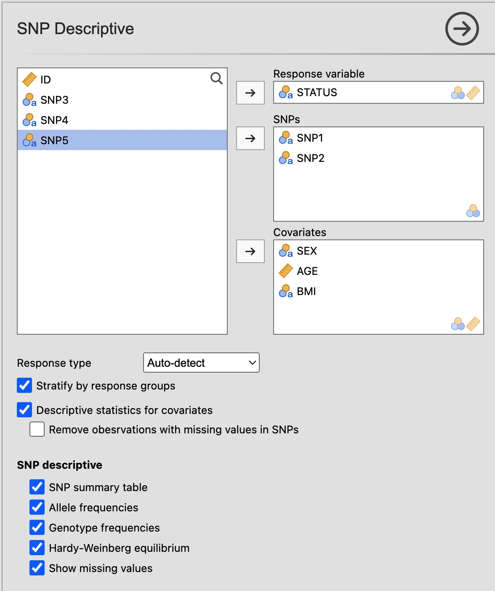
*Figure 1. SNP Descriptive options panel showing variable assignment, response type, and analysis checkboxes.*

The panel exposes the following options:

- **Stratify by response groups** — when the response is binary, all frequency and HWE tables gain separate columns for controls (0) and cases (1).
- **Descriptive statistics for covariates** — produces a covariate summary table (requires at least one covariate; see [Covariate summary](#covariate-summary) below).
- **Remove observations with missing values in SNPs** — applies complete-case filtering on SNP columns before computing any statistic.

Under **SNP descriptive**, individual outputs can be toggled independently:

| Checkbox                    | Output produced                                                                        |
| --------------------------- | -------------------------------------------------------------------------------------- |
| SNP summary table           | One-row-per-SNP overview: alleles, N typed, missing, MAF, AA/AB/BB counts, HWE p-value |
| Allele frequencies          | Per-SNP allele counts and proportions, stratified when applicable                      |
| Genotype frequencies        | Per-SNP genotype counts and proportions, stratified when applicable                    |
| Hardy–Weinberg equilibrium | Exact HWE test p-value, overall and per stratum                                        |
| Show missing values         | Adds a Missing row to frequency tables                                                 |

### Covariate summary

Enable **Descriptive statistics for covariates** to obtain a covariate summary table (Figure 2). Each variable is summarised as follows:

- **Categorical variables**: frequency counts and column percentages per level.
- **Continuous variables**: mean ± standard deviation.

When **Stratify by response groups** is active and the response is binary, the table gains separate columns for each group plus a p-value column: χ² test for categorical variables and independent-samples t-test for continuous variables.

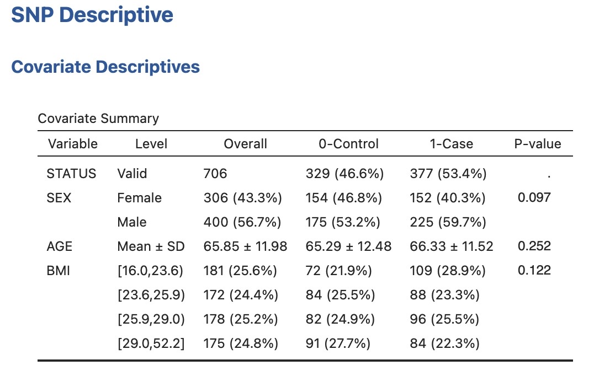
*Figure 2. Covariate summary stratified by case/control status (STATUS). The p-value column uses χ² for SEX and BMI (categorical) and a t-test for AGE (continuous).*

In the example dataset (n = 706; 329 controls, 377 cases), none of the covariates differ significantly between groups: SEX (p = 0.097), AGE (p = 0.252), BMI (p = 0.122).

### SNP summary table

Enable **SNP summary table** to obtain a compact overview of all SNPs in a single table (Figure 3). For each SNP and group the table reports:

- **Alleles (A/B)**: reference (A, most frequent homozygote) and variant (B) alleles.
- **N**: number of typed individuals.
- **Missing**: count of individuals with missing genotype.
- **MAF (B)**: minor allele frequency of the B allele.
- **AA / AB / BB**: raw genotype counts.
- **HWE p-value**: exact test p-value.

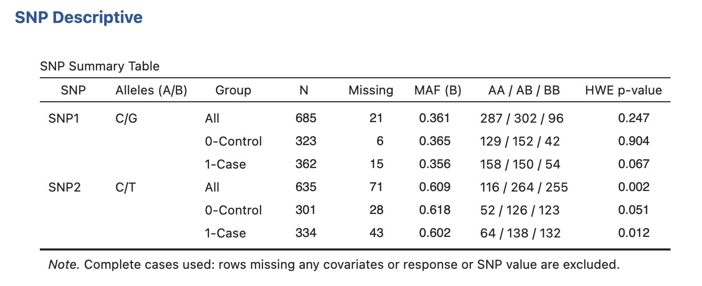
*Figure 3. SNP summary table for SNP1 (C/G) and SNP2 (C/T), overall and stratified by case/control status.*

In the example, SNP1 (C/G) has MAF = 0.361 and is in HWE overall (p = 0.247). SNP2 (C/T) has MAF = 0.609 and shows a significant deviation from HWE in the full sample (p = 0.002) and among cases (p = 0.012), warranting further quality-control investigation.

### Allele and genotype frequencies

Enable **Allele frequencies** and **Genotype frequencies** for per-SNP detailed tables (Figure 4). Counts and proportions are computed over typed individuals only; missing genotypes are excluded from denominators but reported separately when **Show missing values** is checked.

Allele frequencies are derived by counting each allele separately across both chromosomes:

$$
\text{Allele freq}(A) = \frac{2 \times N_{AA} + N_{AB}}{2 \times N_{\text{typed}}}
$$

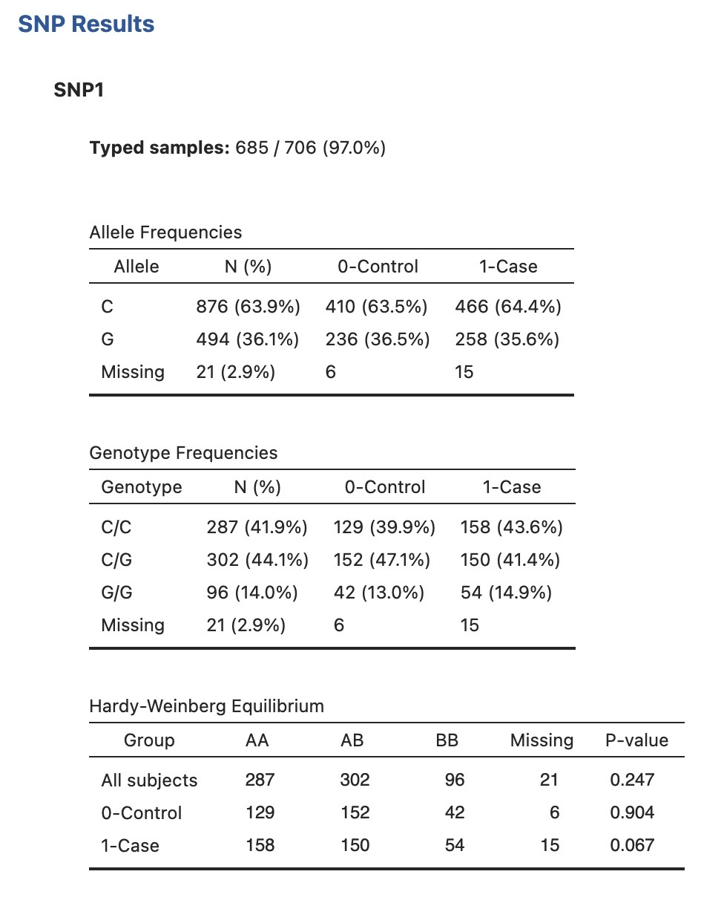
*Figure 4. Allele frequencies, genotype frequencies, and HWE test for SNP1 (C/G). The C allele is more common (63.9%). Genotype distributions are similar between controls and cases.*

### Hardy–Weinberg equilibrium

Enable **Hardy–Weinberg equilibrium** to obtain an exact test p-value for each SNP. Under HWE, allele frequencies within a large, randomly mating population remain constant across generations, and genotype proportions follow the expected binomial distribution. A significant departure may indicate genotyping error, population stratification, or selection at or near the locus.

When **Stratify by response groups** is active, HWE is tested separately within controls and cases (Figure 4, bottom panel). Deviation from HWE in controls only is a particular concern for genotyping quality, whereas deviation only in cases could reflect genuine selection.

In the example, SNP1 does not depart from HWE in any group. SNP2 shows significant deviation overall and in controls, which may warrant exclusion or additional quality checks before proceeding to association analysis. HWE in cases only may be indicative of an association with the disease.

---

## SNP Association Analysis module

The **SNP Association Analysis** module (Figure 5) tests each SNP individually for association with the response and, optionally, for interaction with a covariate.

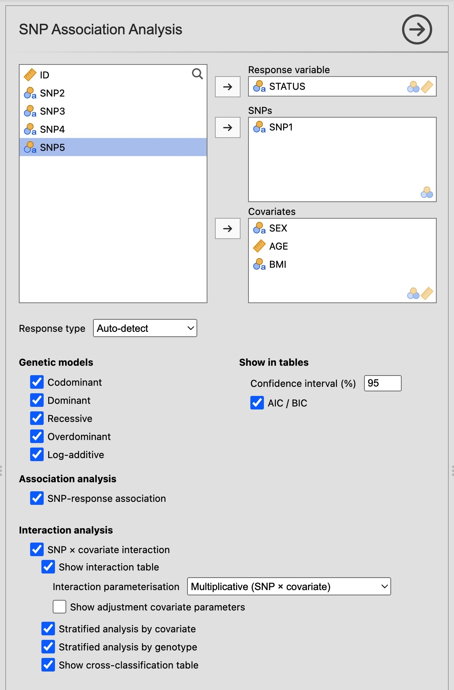
*Figure 5. SNP Association Analysis options panel. Genetic models, confidence interval width, AIC/BIC display, and interaction sub-analyses are all configurable.*

Assign the response variable, one or more SNPs, and any covariates. When covariates are present, every model is adjusted for them. The number of observations excluded due to missing covariate values is reported in a table note.

### Association with outcome

Enable **SNP-response association** to fit a regression model — logistic for binary, linear for continuous — for each SNP under each selected genetic model (Figure 6). Let **A** be the reference allele (the allele in the most frequent homozygote) and **B** the variant allele. The five available models are:

| Model        | Comparison encoded                           | Interpretation                                              |
| ------------ | -------------------------------------------- | ----------------------------------------------------------- |
| Codominant   | AA = 0, AB = 1, BB = 2 (two dummy variables) | Tests each heterozygote and homozygote separately vs. AA    |
| Dominant     | AA = 0, AB + BB = 1                          | Any copy of B increases risk equally                        |
| Recessive    | AA + AB = 0, BB = 1                          | Two copies of B required for effect                         |
| Overdominant | AA + BB = 0, AB = 1                          | Heterozygote advantage/disadvantage                         |
| Log-additive | 0, 1, 2 copies of B                          | Each additional B allele multiplies OR by a constant factor |

For each model the table reports: genotype group counts by case/control status, OR (or β for linear), lower and upper confidence interval bounds, p-value, AIC, and BIC. The **first p-value in the Codominant model is the likelihood ratio test (LRT) p-value** for overall association, comparing the two-degree-of-freedom codominant model against the null. AIC and BIC facilitate model comparison across genetic models — a lower value indicates a better-fitting, more parsimonious model.

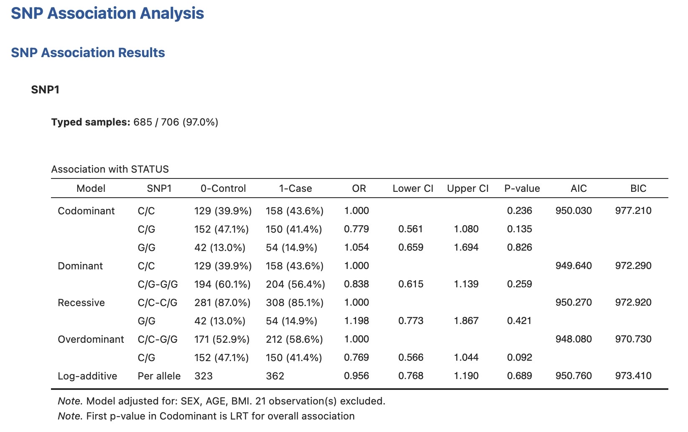
*Figure 6. SNP Association Results for SNP1 adjusted for SEX, AGE, and BMI. No model shows significant association (LRT p = 0.236 for Codominant). The Overdominant model has the lowest AIC (948.08), though differences are small.*

In the example, SNP1 shows no significant association with STATUS under any model after adjustment for SEX, AGE, and BMI (all p > 0.09). The log-additive OR per G allele is 0.956 (95% CI: 0.768–1.190, p = 0.689), consistent with a null effect.

### SNP × covariate interaction

Enable **SNP × covariate interaction** to test whether the SNP effect on outcome differs across levels of the first covariate listed (Figure 7). The interaction model is:

$$
\text{logit}(p) = \beta_0 + \beta_1{\text{SNP}} + \beta_2{\text{Z}} + \beta_{\text{int}}{SNP \times Z}
$$

The interaction table lists OR and 95% CI for SNP main effects, the covariate main effect, and each SNP × covariate product term $\beta_{\text{int}}$, that is a vector ans size depends on the genetic model and covariate categories. The **Interaction p-value (LRT)** compares the full interaction model against the additive main-effects model and is reported in a table note. The **Interaction parameterisation** dropdown offers three options:

- **Multiplicative (SNP × covariate)** — the default; product terms test departure from multiplicative joint effects.
- **Conditional on covariate (SNP|covariate)** — shows stratified effects for each level of the covariate.
- **Conditional on genotype (covariate|SNP)** — shows stratified effects for each level of the genotype.

Detailed tables for these models are shown below.

The **Show adjustment covariate parameters** checkbox includes the remaining covariates' coefficients in the table.

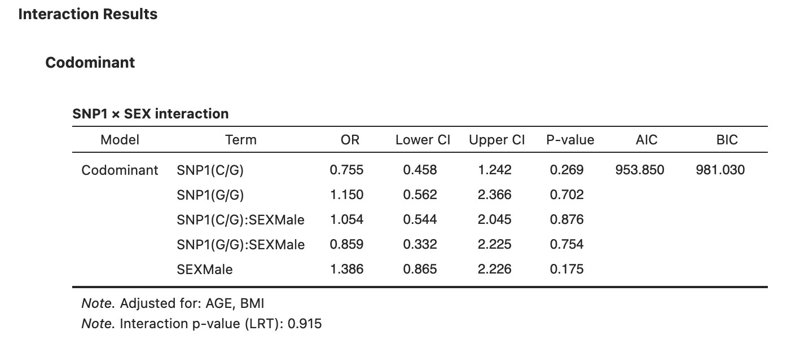
*Figure 7. SNP1 × SEX interaction under the codominant model. The interaction LRT p-value is 0.915, indicating no evidence that the SNP1 effect differs between females and males.*

#### Stratified analysis by covariate

Enable **Stratified analysis by covariate** to parametreize the association model within each level of the interaction covariate (Figure 8). Each stratum table uses the same reference genotype as the pooled analysis, facilitating direct comparison of effect estimates across strata.

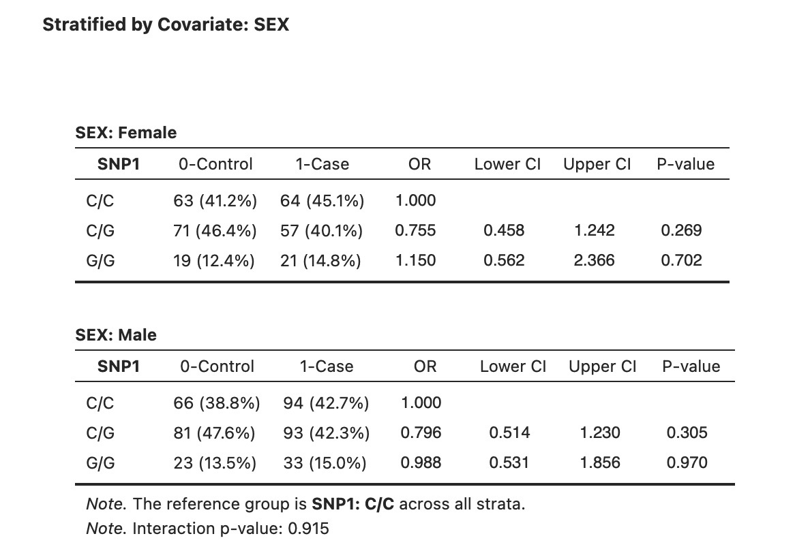
*Figure 8. SNP1 association with STATUS stratified by SEX. Effect estimates are consistent between females and males, corroborating the non-significant interaction (p = 0.915).*

#### Stratified analysis by genotype

Enable **Stratified analysis by genotype** to flip the stratification: the covariate effect on outcome is estimated separately within each genotype group (Figure 9). The reference level of the covariate is held constant across strata.

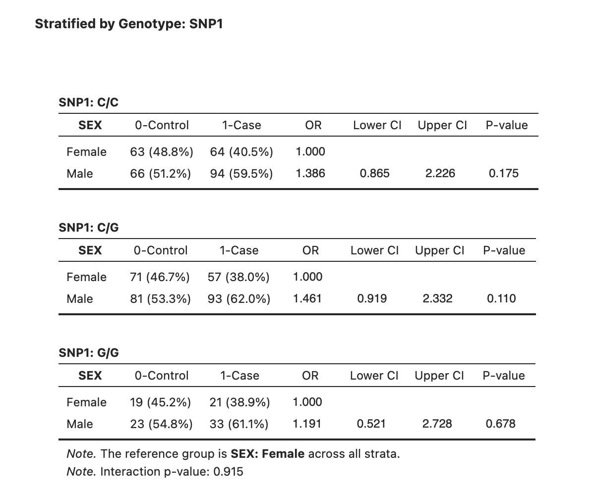
*Figure 9. SEX effect on STATUS within each SNP1 genotype group. Males show a consistently higher OR than females across all genotypes, with no significant variation by genotype.*

#### Cross-classification table

Enable **Show cross-classification table** to display a full factorial breakdown of case/control counts and ORs for every combination of genotype and covariate level (Figure 10). The reference cell is the combination of the reference genotype and the reference covariate level.

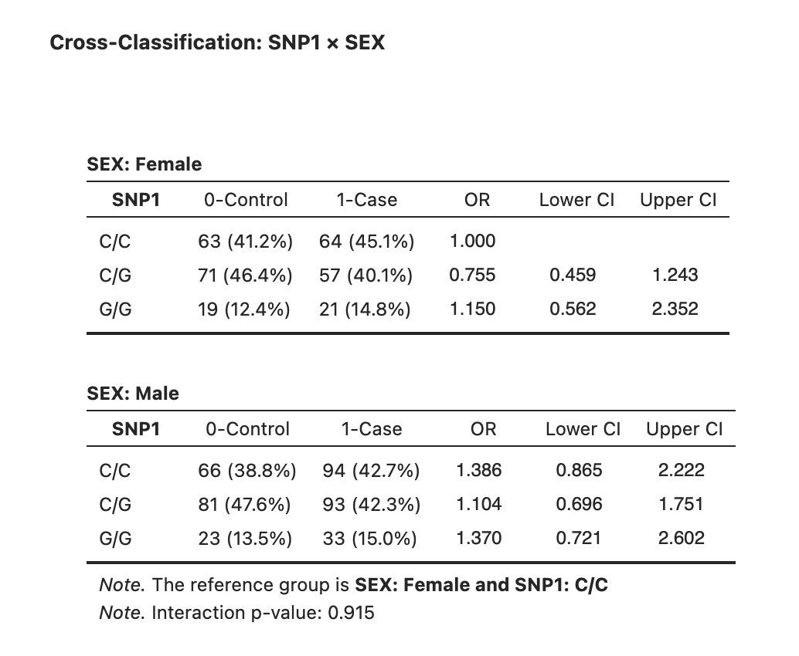
*Figure 10. Cross-classification of SNP1 genotype × SEX with ORs relative to the Female / C/C reference cell. All ORs are consistent with no interaction (LRT p = 0.915).*

---

## LD and Haplotype Analysis module

When two or more SNPs are placed in the SNPs box, the **LD and Haplotype Analysis** module (Figure 11) becomes available. It combines linkage disequilibrium statistics with haplotype frequency estimation and association testing.

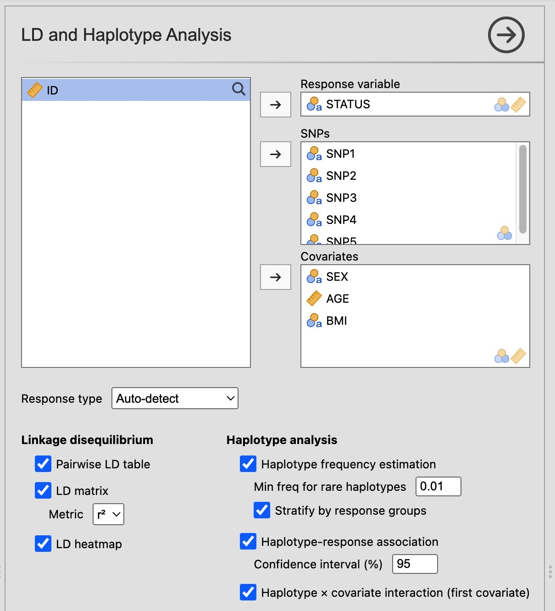
*Figure 11. LD and Haplotype Analysis options panel with five SNPs, three covariates, and all sub-analyses enabled.*

### Linkage disequilibrium

Linkage disequilibrium (LD) is the non-random association of alleles at different loci on the same chromosome. It arises because chromosomes are inherited as blocks, with recombination between neighbouring loci being rare. SNPs in high LD with a causal variant serve as proxies for it, making LD analysis central to fine-mapping and tag-SNP selection.

Enable **Pairwise LD table** to compute three statistics for every pair of SNPs (Figure 12):

| Statistic     | Range       | Interpretation                                                                            |
| ------------- | ----------- | ----------------------------------------------------------------------------------------- |
| **D**   | (−∞, +∞) | Raw covariance of allele frequencies; magnitude depends on allele frequencies             |
| **D′** | [0, 1]      | Scaled D; D′ = 1 means no recombination has been observed between the two alleles        |
| **r²** | [0, 1]      | Squared correlation; r² = 1 means the two SNPs are perfectly interchangeable as tag SNPs |

A p-value testing departure from linkage equilibrium (D = 0) is also reported.

Enable **LD matrix** to display the pairwise r² values (or whichever metric is selected in the **Metric** dropdown) in a square matrix, with p-values in the lower triangle and SNP names on the diagonal (Figure 12, lower panel).

Enable **LD heatmap** for a colour-coded visualisation of the matrix (Figure 13). Cells in the upper triangle show r² values and are shaded from white (r² = 0) to dark red (r² = 1); cells in the lower triangle show p-values.

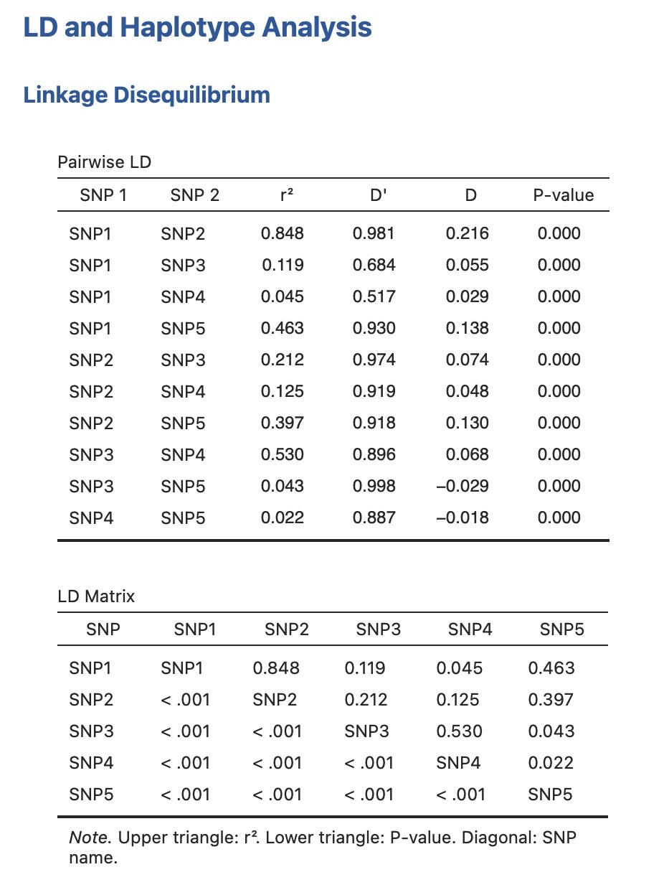
*Figure 12. Pairwise LD results for five SNPs. SNP1 and SNP2 show high LD (r² = 0.848, D′ = 0.981). SNP3 and SNP4 show moderate LD (r² = 0.530). All pairs are statistically significant (all p < 0.001).*

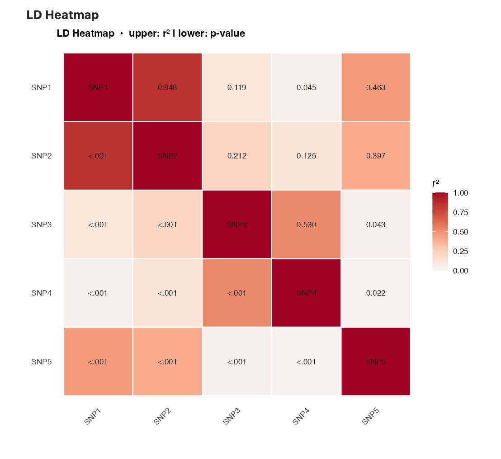
*Figure 13. LD heatmap for five SNPs. The SNP1–SNP2 block (top-left) is clearly visible. SNP3–SNP4 form a secondary block. SNP5 shows moderate LD with SNP1 and SNP2 but low LD with SNP3 and SNP4.*

### Haplotype frequencies

A haplotype is the combination of alleles across multiple loci on a single chromosome. Because standard genotyping does not resolve which alleles reside on the same chromosome (phase is unknown for doubly heterozygous individuals), haplotypes must be inferred statistically using the **Expectation–Maximisation (EM) algorithm**, which iterates between:

1. **E-step**: compute the posterior probability of each possible haplotype pair for each individual, given current frequency estimates.
2. **M-step**: update haplotype frequency estimates as the weighted average of haplotype assignments across individuals.

Enable **Haplotype frequency estimation** to run the EM algorithm and obtain a haplotype frequency table (Figure 14). The **Min freq for rare haplotypes** field (default 0.01) pools all haplotypes with estimated frequency below the threshold into a single *Rare* category. When **Stratify by response groups** is active, frequencies are shown separately for controls and cases.

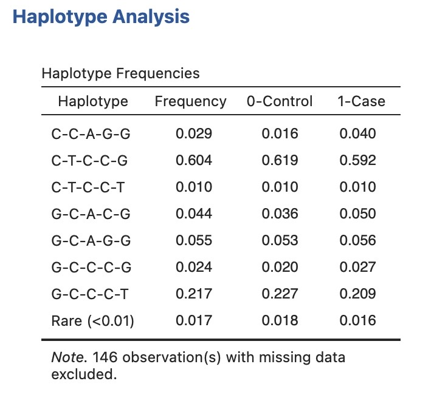
*Figure 14. Haplotype frequency table for five SNPs. The most common haplotype is C-T-C-C-G (freq = 0.604), followed by G-C-C-C-T (0.217). Haplotype C-C-A-G-G is enriched in cases (0.040) relative to controls (0.016).*

In the five-SNP example, eight distinct haplotypes exceed the 0.01 threshold plus one *Rare* pooled category. The two dominant haplotypes together account for about 82% of chromosomes.

### Haplotype association

Enable **Haplotype-response association** to test each haplotype for association with the outcome using `haplo.glm` from the `haplo.stats` package (Figure 15). This method fits a regression model weighted by the posterior probability of each haplotype assignment for every individual, correctly propagating phase uncertainty into the parameter estimates.

The most frequent haplotype is automatically selected as the reference category. The table reports OR (binary outcome) or β (continuous outcome) with confidence interval and p-value for each common haplotype, plus the pooled *Rare* term. When covariates are included, the model adjusts for them.
regarding sample size used, haplotypes estimated with the EM algorithm allow for missing values in some SNPs. Only cases with all SNPs missing are excluded.

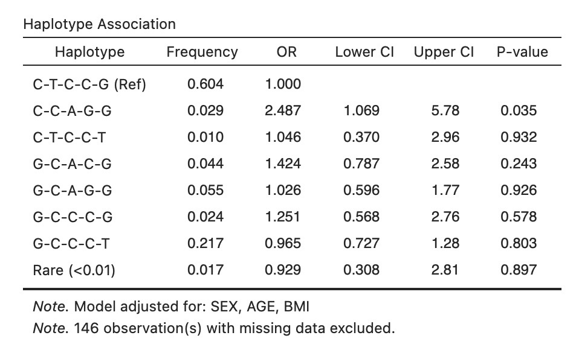
*Figure 15. Haplotype association with STATUS, adjusted for SEX, AGE, and BMI. Haplotype C-C-A-G-G shows a significant association (OR = 2.487, 95% CI: 1.069–5.78, p = 0.035) relative to the reference C-T-C-C-G. No other haplotype reaches significance.*

### Haplotype × covariate interaction

Enable **Haplotype × covariate interaction** to test whether haplotype effects differ across levels of the first covariate (Figure 16). The interaction model is:

$$
\text{logit}(p) = \beta_0 + \sum_h \beta_h H_h + \beta_Z Z + \sum_h \beta_{h \times Z}(H_h \times Z)
$$

The table lists main haplotype effects, the covariate main effect, and each haplotype × covariate product term with OR, 95% CI, and p-value. An overall likelihood ratio test for interaction is reported in a table note, computed as the deviance difference between the full interaction model and the main-effects-only model.

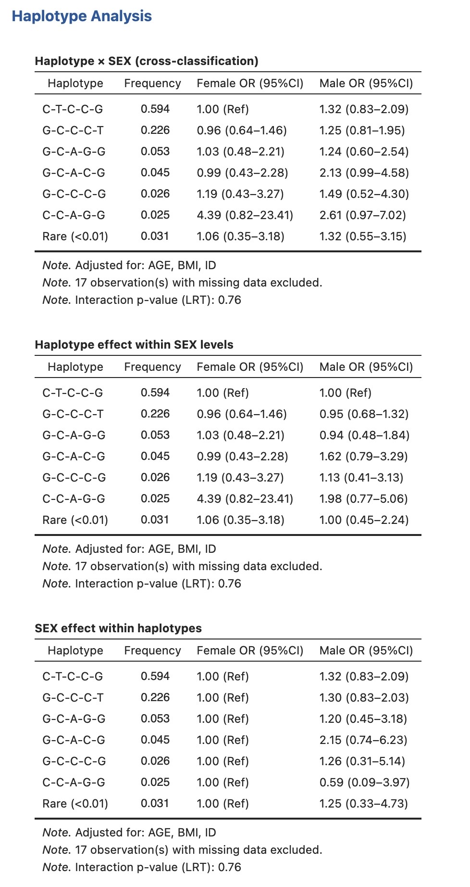
*Figure 16. Haplotype × SEX interaction. No haplotype × SEX interaction term is individually significant, and the overall LRT for interaction is p = 0.852, indicating that the haplotype effects do not differ by sex.*

---

## References

Sole X, Guino E, Valls J, Iniesta R, Moreno V (2006). SNPStats: a web tool for the analysis of association studies. *Bioinformatics* 22(15):1928–1929.

Daniel S, Sinnwell J (2026). haplo.stats: Statistical Analysis of Haplotypes with Traits and Covariates when Linkage Phase is Ambiguous. R package version 1.9.8.3, https://CRAN.R-project.org/package=haplo.stats.
