# SNP Analysis Tutorial

## Overview

The **snpstats** jamovi module provides a complete pipeline for single-SNP and multi-SNP genetic association analyses. It is organised into two modules accessible from the **SNPstats** menu:

- **SNP Analysis** — a single module with three tabs: *Descriptive*, *Association*, and *LD and Haplotype*. Variable assignments (SNPs, response, covariates) are shared across tabs, so you configure them once and switch between analyses without re-entering variables.
- **Polygenic Score (PGS)** — computes weighted or unweighted polygenic scores, applies QC filters, and tests score–outcome associations.

---

## Data format

Each row in the dataset represents one individual. SNP genotypes must be stored as character columns using diploid notation — two alleles separated by a delimiter, or concatenated as two characters. The module accepts the following formats:

| Format | Separator          | Example values   |
| ------ | ------------------ | ---------------- |
| A/B    | slash `/`        | T/T, T/C, C/C    |
| A\|B   | pipe `\|`         | T\|T, T\|C, C\|C |
| A>B    | greater-than `>` | T>T, T>C, C>C    |
| AB     | none (2 chars)     | TT, TC, CC       |

Any allele names are accepted (single nucleotides, insertion/deletion codes, etc.), provided that exactly two distinct alleles appear across the column. Columns with three or more alleles, or inconsistent genotype combinations (e.g. A/A, A/C, B/C) are flagged and excluded with an informative message.

**Allele order** is initially defined by the frequency, sorting the most frequent allele first so it becomes the reference for analysis of association. This can be changed in Jamovi Data panel.

The **response variable** should be a binary (case/control coded 0/1 or as a two-level factor), categorical (multi-level factor) or continuous column. **Covariates** can be numeric or categorical.

---

## SNP Analysis module

The **SNP Analysis** module (Figure 1) is the starting point for any analysis. Assign the response variable, one or more SNPs, and any covariates in the shared variable assignment panel at the top. 

There are two global options, that affect multiple analyses:

- **Complete cases analysis** — removes all observations with any missing value in SNPs, response, or covariates before any analysis. Missing rows are suppressed from output; a table note reports how many cases were excluded. If not selected, missing values are excluded analysis-wise.

- **Stratify by response groups** — when the response is binary or categorical, all descriptive tables gain separate columns for response groups. Use **Response type** — to override the automatic response detection, which selects logistic regression for binary outcomes, polytomous regression for categorical outcomes, and linear regression for continuous outcomes; override it when automatic detection produces unexpected results.

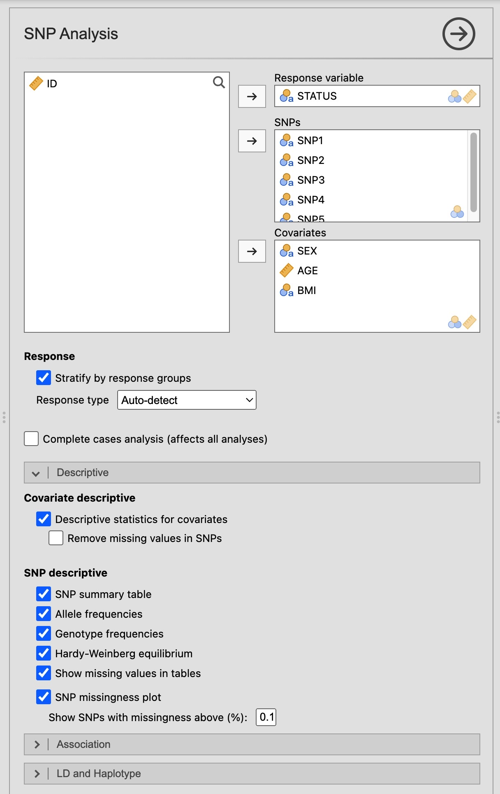
*Figure 1. SNP Analysis options panel showing shared variable assignment, response type, and the three analysis tabs.*

---

## Descriptive tab

The **Descriptive** tab provides genotype and allele frequency summaries, Hardy–Weinberg equilibrium tests, and covariate descriptions.

### Covariate descriptive

Enable **Descriptive statistics for covariates** to obtain a covariate summary table [Figure 2](#covariate-descriptive). Each variable is summarised as follows:

- **Categorical variables**: frequency counts and column percentages per level.
- **Continuous variables**: mean ± standard deviation.

When **Stratify by response groups** is active and the response is binary or categorical, the table gains separate columns for each group plus a p-value column: χ² test for categorical variables and independent-samples t-test or ANOVA for continuous variables.

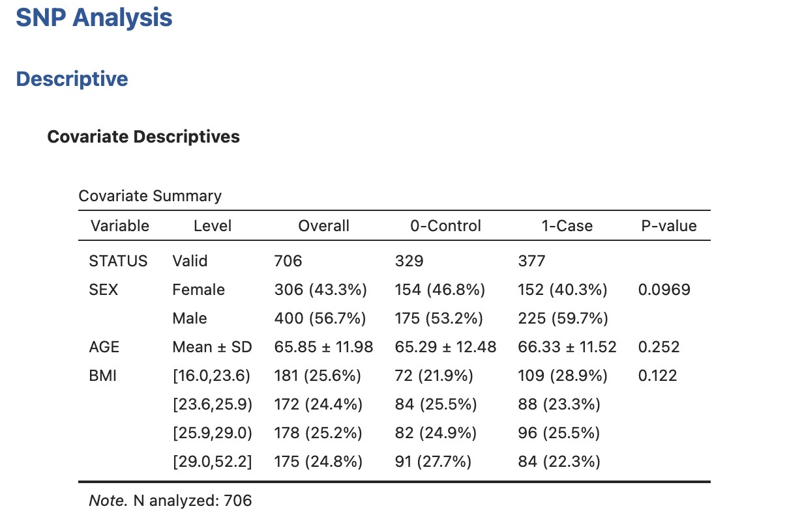
*Figure 2. Covariate summary stratified by case/control status (STATUS). The p-value column uses χ² for SEX and BMI (categorical) and a t-test for AGE (continuous).*

In the example dataset (n = 706; 329 controls, 377 cases), none of the covariates differ significantly between groups: SEX (p = 0.0969), AGE (p = 0.252), BMI (p = 0.122).

- **Remove missing values in SNPs** — applies complete-case filtering on SNP columns before computing any statistic. This option only affects the Covariate descriptive table.

### SNP descriptive

Enable **SNP summary table** to obtain a compact overview of all SNPs in a single table [Figure 3](#snp-descriptive). For each SNP and group the table reports:

- **Alleles (A/B)**: reference (A, most frequent homozygote) and variant (B) alleles.
- **N**: number of typed individuals.
- **Missing**: count of individuals with missing genotype.
- **MAF (B)**: minor allele frequency of the B allele.
- **AA / AB / BB**: raw genotype counts.
- **HWE p-value**: exact test p-value.

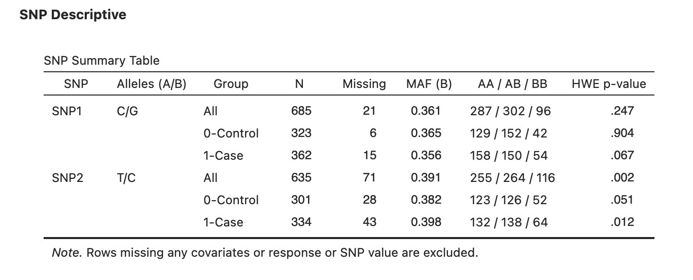
*Figure 3. SNP summary table for SNP1 (C/G) and SNP2 (C/T), overall and stratified by case/control status.*

In the example, SNP1 (C/G) has MAF = 0.361 and is in HWE overall (p = 0.247). SNP2 (C/T) has MAF = 0.609 and shows a significant deviation from HWE in the full sample (p = 0.002) and among cases (p = 0.012), warranting further quality-control investigation.

Detailed outputs can be toggled independently:

| Checkbox                    | Output produced                                                                        |
| --------------------------- | -------------------------------------------------------------------------------------- |
| **Allele frequencies**          | Per-SNP allele counts and proportions, stratified when applicable |
| **Genotype frequencies**        | Per-SNP genotype counts and proportions, stratified when applicable |
| **Hardy–Weinberg equilibrium** | Exact HWE test p-value, overall and per stratum |
| **Show missing values** | Adds a Missing row to frequency tables |
| **Show SNP missingness plot** | displays a bar chart of missing genotype rates per SNP; only SNPs exceeding the **Show SNPs with missingness above (%)** threshold are plotted |

### Allele and genotype frequencies

Enable **Allele frequencies** and **Genotype frequencies** for per-SNP detailed tables (Figure 4). Counts and proportions are computed over typed individuals only; missing genotypes are excluded from denominators but reported separately when **Show missing values** is checked.

Allele frequencies are derived by counting each allele separately across both chromosomes:

$$
\text{Allele freq}(A) = \frac{2 \times N_{AA} + N_{AB}}{2 \times N_{\text{typed}}}
$$

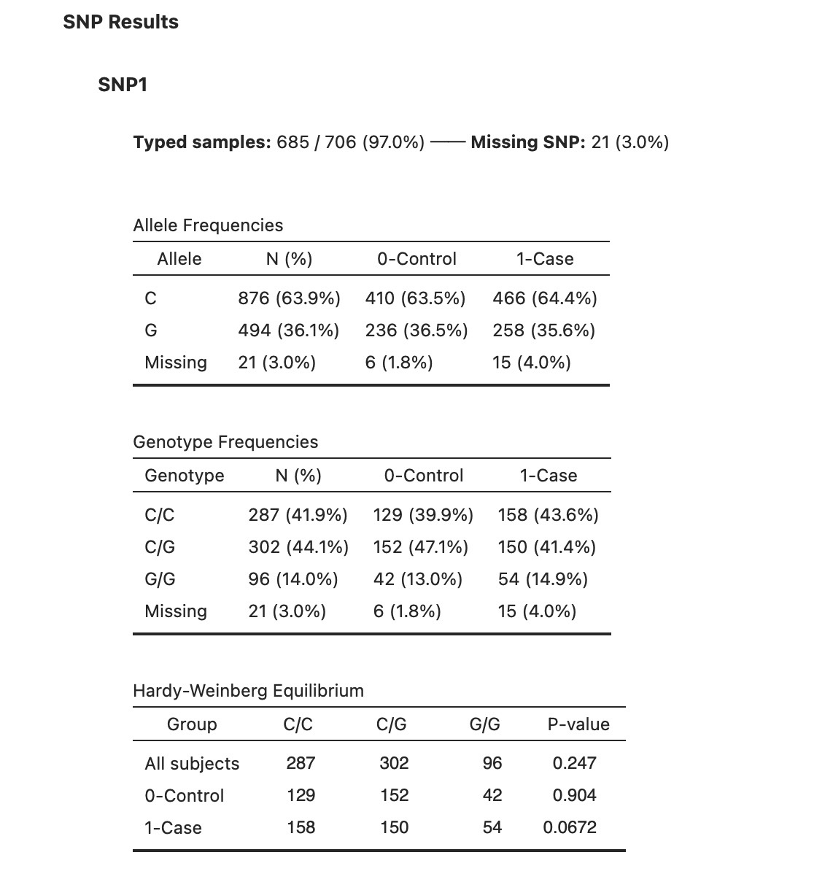
*Figure 4. Allele frequencies, genotype frequencies, and HWE test for SNP1 (C/G). The C allele is more common (63.9%). Genotype distributions are similar between controls and cases.*

### Hardy–Weinberg equilibrium

Enable **Hardy–Weinberg equilibrium** to obtain an exact test p-value for each SNP. Under HWE, allele frequencies within a large, randomly mating population remain constant across generations, and genotype proportions follow the expected binomial distribution. A significant departure may indicate genotyping error, population stratification, or selection at or near the locus.

When **Stratify by response groups** is active, HWE is tested separately within controls and cases (Figure 4, bottom panel). Deviation from HWE in controls only is a particular concern for genotyping quality, whereas deviation only in cases could reflect genuine selection.

In the example, SNP1 does not depart from HWE in any group. SNP2 shows significant deviation overall and in controls, which may warrant exclusion or additional quality checks before proceeding to association analysis. HWE in cases only may be indicative of an association with the disease.

### SNP missingness plot

Enable **Show SNP missingness plot** to display a bar chart of missing genotype rates per SNP; only SNPs exceeding the **Show SNPs with missingness above (%)** threshold are plotted.

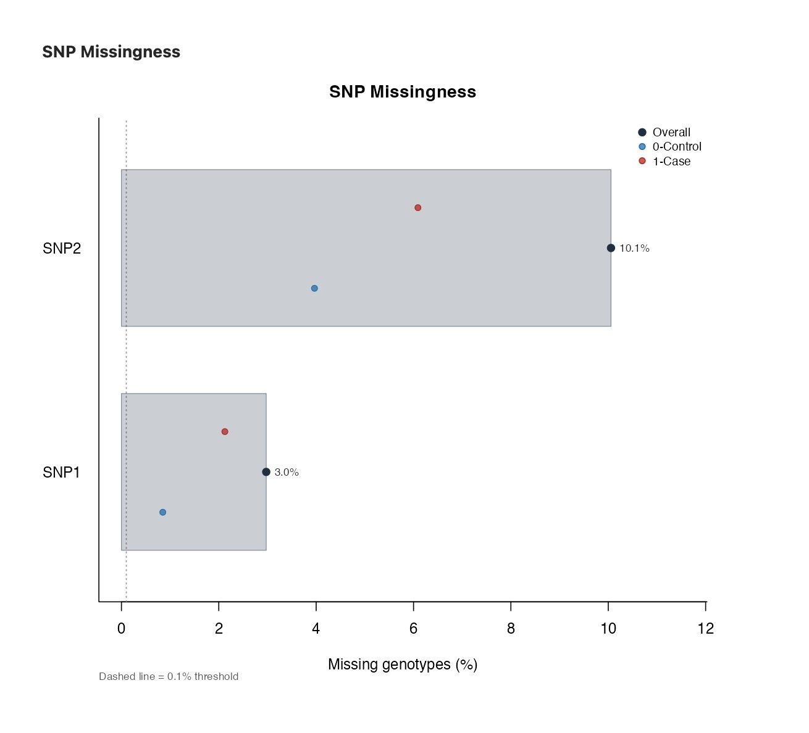
*Figure 5. SNP missingness plot. Only SNPs exceeding the missingness threshold are plotted.* The axis is in % scale.

---

## Association tab

The **Association** tab tests each SNP individually for association with the response and, optionally, for interaction with a covariate.

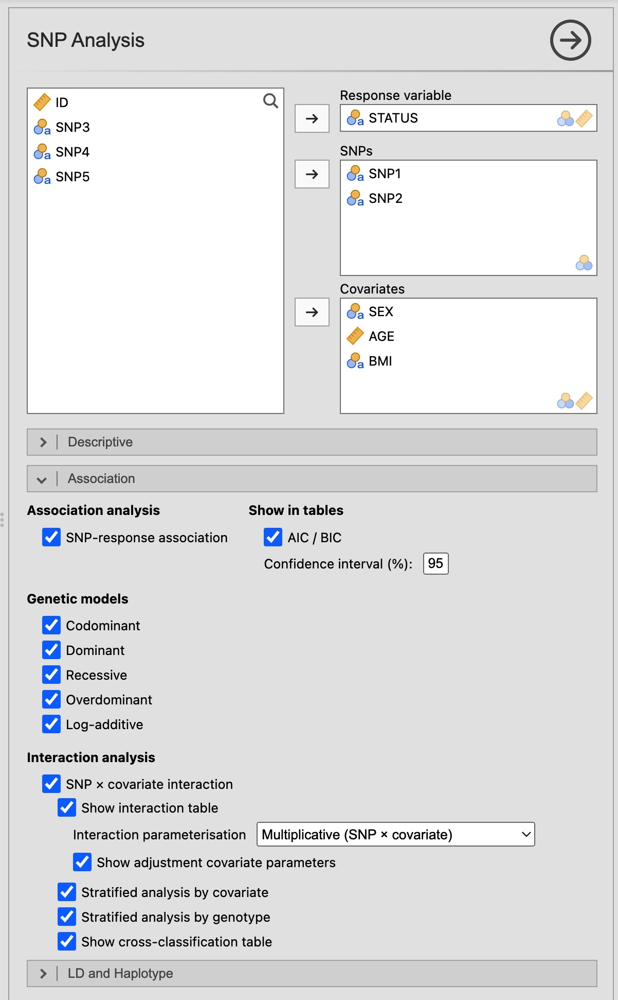
*Figure 6. Association tab options. Genetic models, confidence interval width, AIC/BIC display, and interaction sub-analyses are all configurable.*

When covariates are present, every model is adjusted for them. The number of observations excluded due to missing covariate values is reported in a table note.

### Association with outcome

Enable **SNP-response association** to fit a regression model — logistic for binary, linear for continuous — for each SNP under each selected genetic model (Figure 7). Let **A** be the reference allele (the allele in the most frequent homozygote) and **B** the variant allele. The five available models are:

| Model        | Comparison encoded                           | Interpretation                                              |
| ------------ | -------------------------------------------- | ----------------------------------------------------------- |
| Codominant   | AA = 0, AB = 1, BB = 2 (two dummy variables) | Tests each heterozygote and homozygote separately vs. AA    |
| Dominant     | AA = 0, AB + BB = 1                          | Any copy of B increases risk equally                        |
| Recessive    | AA + AB = 0, BB = 1                          | Two copies of B required for effect                         |
| Overdominant | AA + BB = 0, AB = 1                          | Heterozygote advantage/disadvantage                         |
| Additive     | 0, 1, 2 copies of B                          | Each additional B allele multiplies OR by a constant factor (log-additive on the logit scale for a binary response fitted by logistic regression) |

For each model the table reports: genotype group counts by case/control status, OR (or β for linear), lower and upper confidence interval bounds, a p-value, AIC, and BIC. Each model's p-value is the **likelihood-ratio test** (binary/categorical) or **F-test** (quantitative) for overall association — comparing that genetic model against the covariate-only null — shown once on the model's reference row (two degrees of freedom for the codominant model, one for the others); the individual genotype rows do not carry a separate p-value. This matches the p-values reported by the SNPstats web tool. AIC and BIC facilitate model comparison across genetic models — a lower value indicates a better-fitting, more parsimonious model.

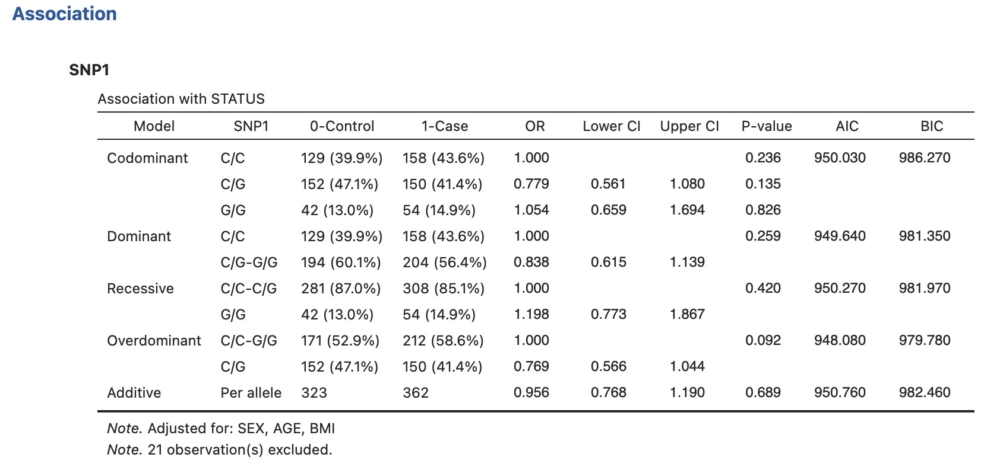
*Figure 7. SNP Association Results for SNP1 adjusted for SEX, AGE, and BMI. Each model reports one p-value (the likelihood-ratio test) on its reference row; the individual genotype rows carry only the OR and CI. No model shows a significant association (LRT p = 0.236 for Codominant). The Overdominant model has the lowest AIC (948.08), though differences are small.*

In the example, SNP1 shows no significant association with STATUS under any model after adjustment for SEX, AGE, and BMI (all p > 0.09). The additive (log-additive for this logistic model) OR per G allele is 0.956 (95% CI: 0.768–1.190, p = 0.689), consistent with a null effect.

### SNP × covariate interaction

Enable **SNP × covariate interaction** to test whether the SNP effect on outcome differs across levels of the first covariate listed (Figure 8). The interaction model is:

$$
\text{logit}(p) = \beta_0 + \beta_1{\text{SNP}} + \beta_2{\text{Z}} + \beta_{\text{int}}{SNP \times Z}
$$

The interaction table lists OR and 95% CI for SNP main effects, the covariate main effect, and each SNP × covariate product term $\beta_{\text{int}}$, that is a vector ans size depends on the genetic model and covariate categories. The **Interaction p-value (LRT)** compares the full interaction model against the additive main-effects model and is reported in a table note. The **Interaction parameterisation** dropdown offers three options:

- **Multiplicative (SNP × covariate)** — the default; product terms test departure from multiplicative joint effects.
- **Conditional on covariate (SNP|covariate)** — shows stratified effects for each level of the covariate.
- **Conditional on genotype (covariate|SNP)** — shows stratified effects for each level of the genotype.

Detailed tables for these models are shown below.

The **Show adjustment covariate parameters** checkbox includes the remaining covariates' coefficients in the table.

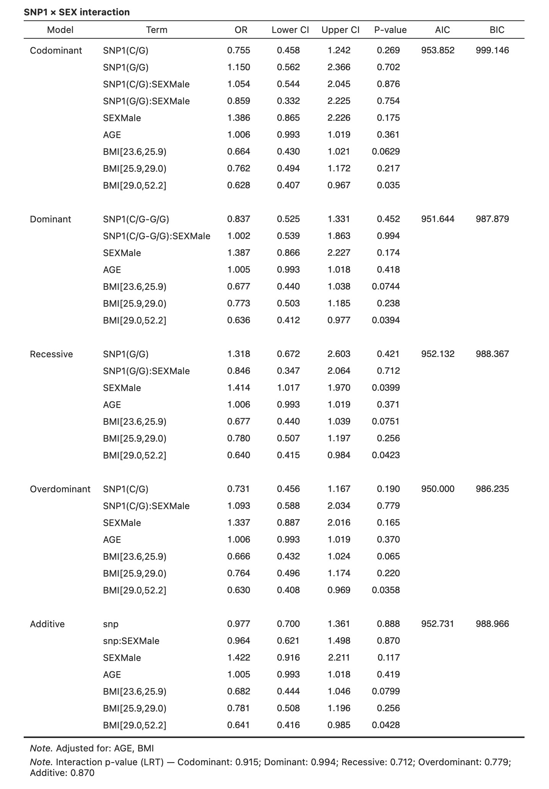
*Figure 8. SNP1 × SEX interaction under the codominant model. The interaction LRT p-value is 0.915, indicating no evidence that the SNP1 effect differs between females and males.*

#### Stratified analysis by covariate

Enable **Stratified analysis by covariate** to parametreize the association model within each level of the interaction covariate (Figure 9). Each stratum table uses the same reference genotype as the pooled analysis, facilitating direct comparison of effect estimates across strata.

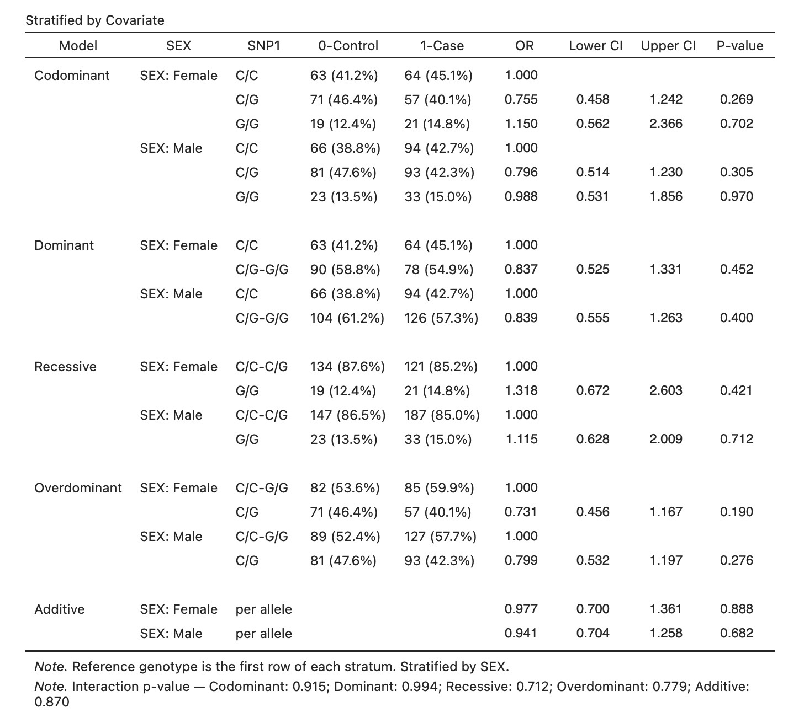
*Figure 9. SNP1 association with STATUS stratified by SEX. Effect estimates are consistent between females and males, corroborating the non-significant interaction (p = 0.915).*

#### Stratified analysis by genotype

Enable **Stratified analysis by genotype** to flip the stratification: the covariate effect on outcome is estimated separately within each genotype group (Figure 10). The reference level of the covariate is held constant across strata.

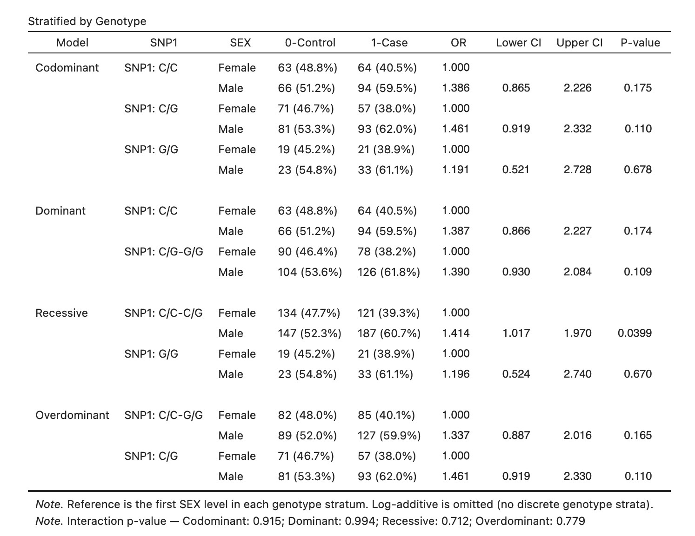
*Figure 10. SEX effect on STATUS within each SNP1 genotype group. Males show a consistently higher OR than females across all genotypes, with no significant variation by genotype.*

#### Cross-classification table

Enable **Show cross-classification table** to display a full factorial breakdown of case/control counts and ORs for every combination of genotype and covariate level (Figure 11). The reference cell is the combination of the reference genotype and the reference covariate level.

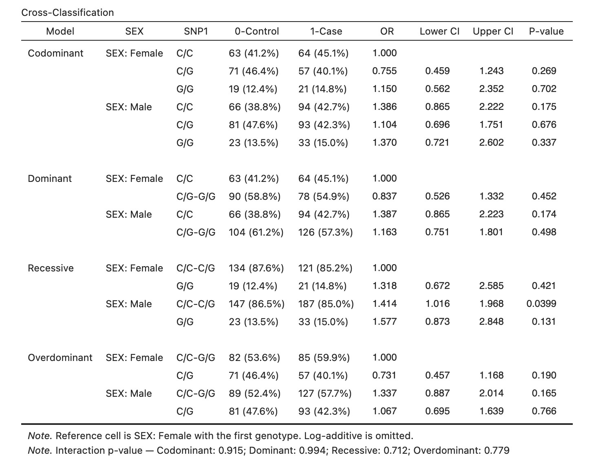
*Figure 11. Cross-classification of SNP1 genotype × SEX with ORs relative to the Female / C/C reference cell. All ORs are consistent with no interaction (LRT p = 0.915).*

---

## LD and Haplotype tab

When two or more SNPs are assigned, the **LD and Haplotype** tab becomes available. It combines linkage disequilibrium statistics with haplotype frequency estimation and association testing.

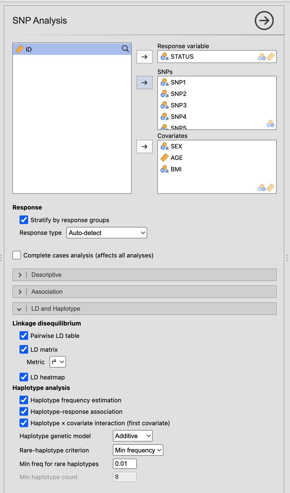
*Figure 12. LD and Haplotype tab with five SNPs, three covariates, and all sub-analyses enabled.*

### Linkage disequilibrium

Linkage disequilibrium (LD) is the non-random association of alleles at different loci on the same chromosome. It arises because chromosomes are inherited as blocks, with recombination between neighbouring loci being rare. SNPs in high LD with a causal variant serve as proxies for it, making LD analysis central to fine-mapping and tag-SNP selection.

Enable **Pairwise LD table** to compute three statistics for every pair of SNPs (Figure 13):

| Statistic     | Range       | Interpretation                                                                            |
| ------------- | ----------- | ----------------------------------------------------------------------------------------- |
| **D**   | (−∞, +∞) | Raw covariance of allele frequencies; magnitude depends on allele frequencies             |
| **D′** | [0, 1]      | Scaled D; D′ = 1 means no recombination has been observed between the two alleles        |
| **r²** | [0, 1]      | Squared correlation; r² = 1 means the two SNPs are perfectly interchangeable as tag SNPs |

A p-value testing departure from linkage equilibrium (D = 0) is also reported.

Enable **LD matrix** to display the pairwise r² values (or whichever metric is selected in the **Metric** dropdown) in a square matrix, with p-values in the lower triangle and SNP names on the diagonal (Figure 13, lower panel).

Enable **LD heatmap** for a colour-coded visualisation of the matrix (Figure 14). Cells in the upper triangle show r² values and are shaded from white (r² = 0) to dark red (r² = 1); cells in the lower triangle show p-values.

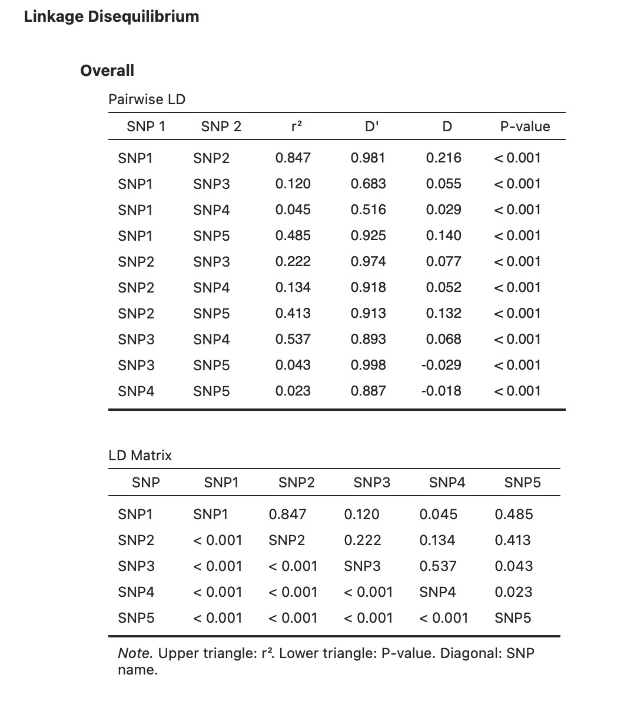
*Figure 13. Pairwise LD results for five SNPs. SNP1 and SNP2 show high LD (r² = 0.847, D′ = 0.981). SNP3 and SNP4 show moderate LD (r² = 0.537). All pairs are statistically significant (all p < 0.001).*

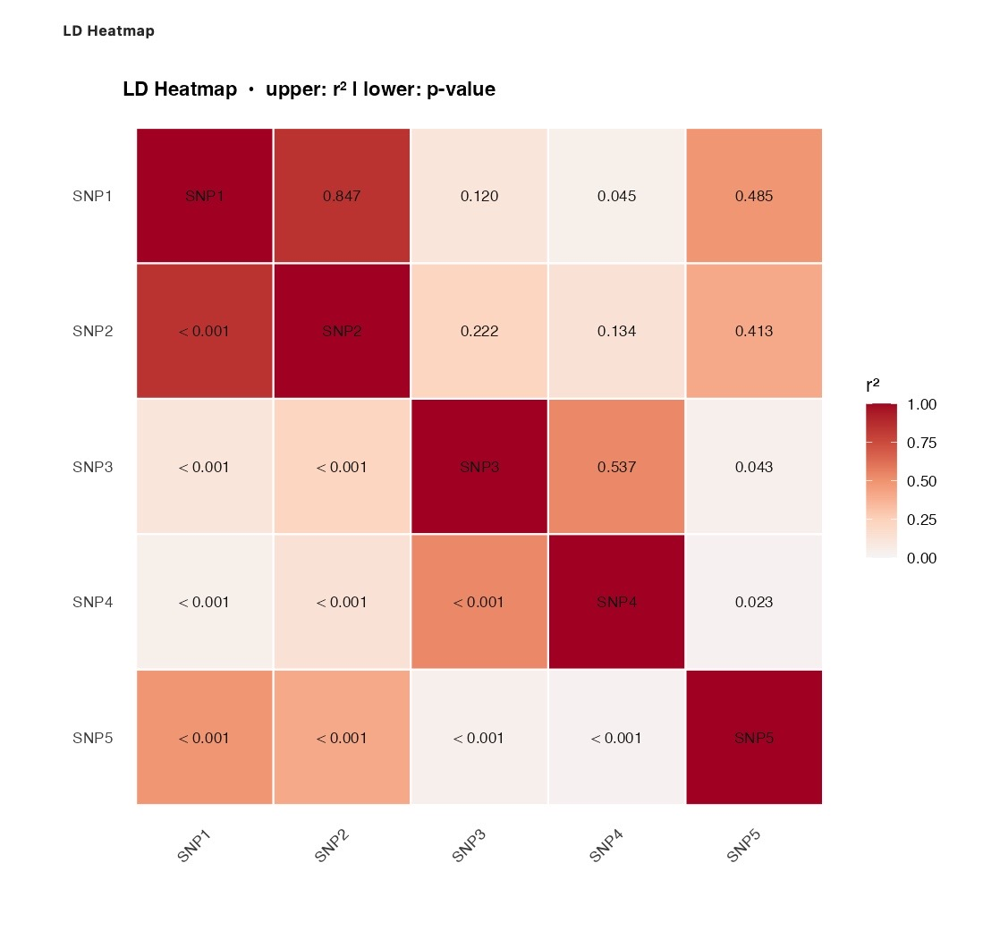
*Figure 14. LD heatmap for five SNPs. The SNP1–SNP2 block (top-left) is clearly visible. SNP3–SNP4 form a secondary block. SNP5 shows moderate LD with SNP1 and SNP2 but low LD with SNP3 and SNP4.*

### Haplotype frequencies

A haplotype is the combination of alleles across multiple loci on a single chromosome. Because standard genotyping does not resolve which alleles reside on the same chromosome (phase is unknown for doubly heterozygous individuals), haplotypes must be inferred statistically using the **Expectation–Maximisation (EM) algorithm**, which iterates between:

1. **E-step**: compute the posterior probability of each possible haplotype pair for each individual, given current frequency estimates.
2. **M-step**: update haplotype frequency estimates as the weighted average of haplotype assignments across individuals.

Enable **Haplotype frequency estimation** to run the EM algorithm and obtain a haplotype frequency table (Figure 15). The **Min freq for rare haplotypes** field (default 0.01) pools all haplotypes with estimated frequency below the threshold into a single *Rare* category. When **Stratify by response groups** is active (the shared option in the SNP Analysis panel), frequencies are shown separately for controls and cases.

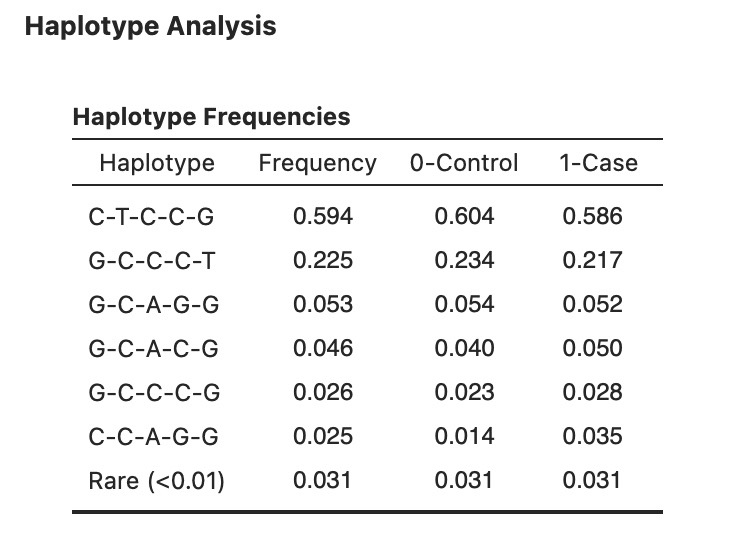
*Figure 15. Haplotype frequency table for five SNPs. The most common haplotype is C-T-C-C-G (freq = 0.594), followed by G-C-C-C-T (0.225). Haplotype C-C-A-G-G is enriched in cases (0.035) relative to controls (0.014).*

In the five-SNP example, six distinct haplotypes exceed the 0.01 threshold plus one *Rare* pooled category. The two dominant haplotypes together account for about 82% of chromosomes.

### Haplotype association

Enable **Haplotype-response association** to test each haplotype for association with the outcome using `haplo.glm` from the `haplo.stats` package (Figure 16). This method fits a regression model weighted by the posterior probability of each haplotype assignment for every individual, correctly propagating phase uncertainty into the parameter estimates.

The most frequent haplotype is automatically selected as the reference category. The table reports OR (binary outcome) or β (continuous outcome) with confidence interval and p-value for each common haplotype, plus the pooled *Rare* term. When covariates are included, the model adjusts for them.
regarding sample size used, haplotypes estimated with the EM algorithm allow for missing values in some SNPs. Only cases with all SNPs missing are excluded.

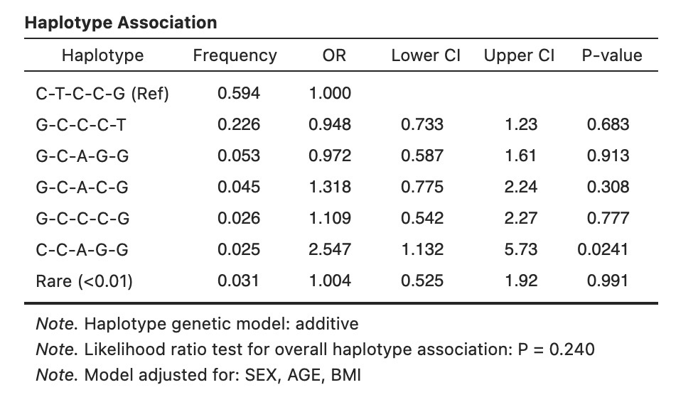
*Figure 16. Haplotype association with STATUS, adjusted for SEX, AGE, and BMI. Haplotype C-C-A-G-G shows a significant association (OR = 2.547, 95% CI: 1.132–5.73, p = 0.024) relative to the reference C-T-C-C-G. No other haplotype reaches significance.*

### Haplotype × covariate interaction

Enable **Haplotype × covariate interaction** to test whether haplotype effects differ across levels of the first covariate (Figure 17). The interaction model is:

$$
\text{logit}(p) = \beta_0 + \sum_h \beta_h H_h + \beta_Z Z + \sum_h \beta_{h \times Z}(H_h \times Z)
$$

The table lists main haplotype effects, the covariate main effect, and each haplotype × covariate product term with OR, 95% CI, and p-value. An overall likelihood ratio test for interaction is reported in a table note, computed as the deviance difference between the full interaction model and the main-effects-only model.

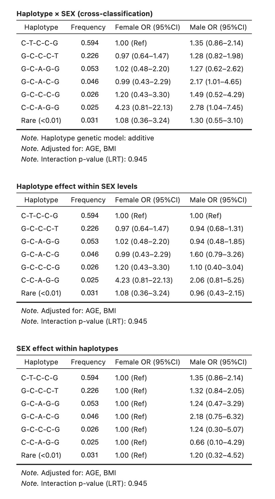
*Figure 17. Haplotype × SEX interaction. No haplotype × SEX interaction term is individually significant, and the overall LRT for interaction is p = 0.945, indicating that the haplotype effects do not differ by sex.*

---

## Polygenic Score (PGS) module

A **polygenic score** (also called a polygenic risk score, PRS) aggregates the effects of many genetic variants across the genome into a single numerical index for each individual. Rather than testing one SNP at a time, a PGS weights each variant's dosage (0, 1, or 2 copies of the effect allele) by its published effect size and sums the products. Higher scores indicate a higher genetic burden of the trait in question relative to the study sample.

The **Polygenic Score** module (Figure 18) can operate in two modes: a fully weighted mode that reads effect sizes from an external weights file (e.g. from the [PGS Catalog](https://www.pgscatalog.org/)), and an unweighted mode that assigns unit weights to all selected SNPs. Both modes can be run simultaneously for comparison.

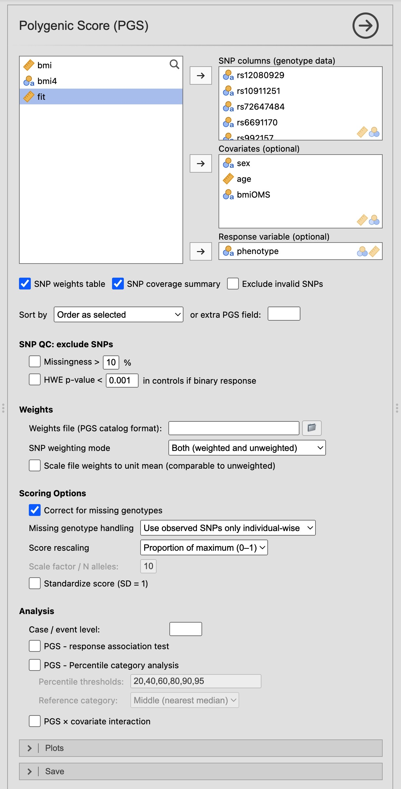
*Figure 18. PGS module options panel showing variable assignment, weighting options, QC filters, scoring settings, and analysis sub-sections.*

The example file CRCgenet-SNPs.tsv will be analyzed, that contains data on 65 SNPs associated with colorectal cancer (CRC). The data were measured in 2838 individuals. This file has been generated permuting randomly real data, to preserve phenotype and sex, but other covariates have been generated randomly. The phenotype corresponds to high-risk adenoma or cancer detected in a study of CRC screening. 

---

### Variable assignment

Assign one or more **SNP columns** (genotype data) to the *SNP columns* box. The same genotype formats accepted by all other modules are supported (slash-, pipe-, or concatenated two-character notation). Numeric dosage columns (values 0, 1, 2) are also accepted, though allele QC cannot be performed on them.

Optionally assign a **response variable** (binary or continuous) and one or more **covariates**. These are used only for the analysis sub-sections (association, percentile regression, interaction); the score itself is computed from the SNP columns alone.

---

### SNP coverage summary

Enable **SNP coverage summary** to display a table that characterises the SNPs and shows some QC checks. This table is updated if a weight file is uploaded, including the match between the weights file and the dataset. 

### SNP QC filters

Two optional filters can exclude SNPs from the score before it is computed:

- **Filter SNPs by missingness** — exclude SNPs whose proportion of missing genotypes across individuals exceeds the **Max missing genotypes (%)** threshold.
- **Filter SNPs by HWE** — exclude SNPs with a Hardy–Weinberg equilibrium exact test p-value below the **HWE p-value threshold**. When a binary response variable is selected, HWE is tested in controls only (the lower/first level), which is the standard approach in case-control GWAS quality control. Filtering by HWE in cases would risk discarding loci that are truly associated with the outcome.

Both filters are applied after per-SNP statistics have been computed, so QC metrics are always shown regardless of whether the SNP is subsequently excluded.
To remove SNPs that do not pass QC from the table, use **Show valid SNPs only**.

---

### Weighting

#### Weights file

The **Weights file** field accepts a path to a file in [PGS Catalog scoring file format](https://www.pgscatalog.org/downloads/#dl_ftp_scoring). The file may be plain text (`.csv`, `.tsv`) with tab or comma separators. Header comment lines beginning with `#` are parsed for catalogue metadata (PGS ID, score name, trait, weight type, genome build, variant count); these appear in the SNP Coverage Summary table.

Required columns are `rsid` (or `variant_id`), `effect_allele`, `other_allele`, and `effect_weight`. Chromosomal position (`chr_name`, `chr_position`) and any additional columns present in the file are retained and displayed in the SNP Weights table. The module matches file entries to dataset columns by the SNP column name; names that appear in the file but not in the dataset are flagged as unmatched.

For our example data, file CRCgenet-PGS.txt has been generated with the weights and effect alleles for the 65 SNPs. The file in fact includes an additional SNP not present in the dataset.

#### SNP weighting mode

The **SNP weighting mode** dropdown controls which score variants are computed:

- **Weighted** — uses effect sizes from the weights file; requires a valid file path. Each SNP's dosage is multiplied by its published effect weight before summing.
- **Unweighted** — assigns a weight of 1 to every SNP. The result is effectively a count of risk alleles across the selected loci.
- **Both** — computes both versions in parallel and displays them side by side in all result tables and plots.

When no weights file is provided, the module automatically falls back to unweighted scoring regardless of the dropdown selection.

#### Scale file weights to unit mean

Enable **Scale weights to unit mean** to L1-normalise the weight vector so that its mean absolute value equals 1 before scoring. This places the weighted and unweighted scores on a comparable numeric scale (both approximate a risk-allele count), making the "Both" mode more informative for direct comparison.

---

**SNP Weights Used for Scoring** (Figure 19) shows one row per SNP from the weights file. Columns include chromosomal position (if available in the file), effect and other alleles, effect weight, match status, and allele QC outcome. Per-SNP statistics computed from the dataset — missingness rate (N and %), effect allele frequency, and HWE p-value — are shown alongside any additional columns from the weights file. The **Allele QC** column uses a traffic-light coding:

| Icon | Meaning |
|------|---------|
| ✅ | SNP matched and alleles verified |
| ⚠ | SNP kept with an action taken (e.g. strand flip, numeric dosage) |
| ❌ | SNP excluded (allele mismatch, multiallelic, all missing, etc.) |

Enable **Show valid SNPs only** to hide rows for SNPs that failed QC, showing only those that contributed to the score.

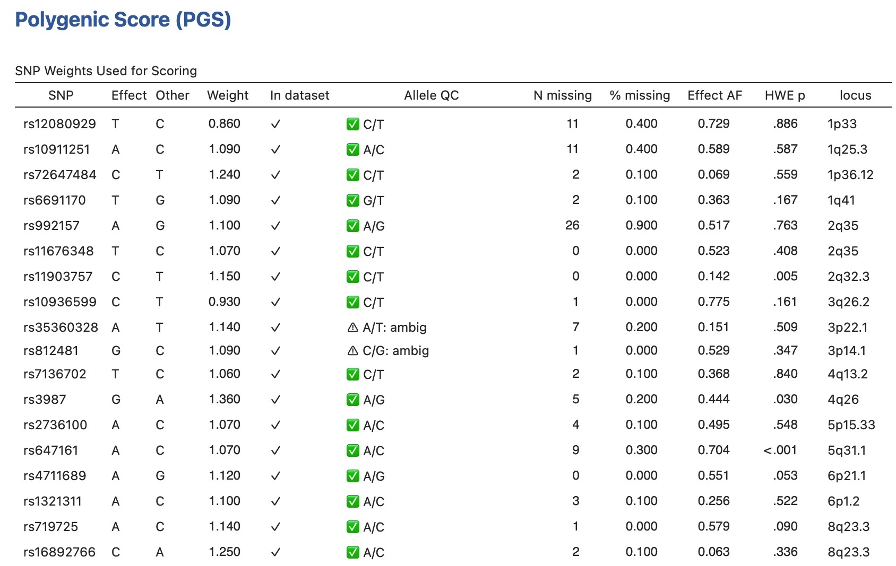
*Figure 19. Fraction of SNP Weights Used for Scoring table. Each row corresponds to one SNP from the weights file. The Allele QC column summarises the per-SNP quality control outcome.*

**SNP Coverage Summary** (Figure 20) condenses the match statistics into a key–value table. It reports: metadata from the file header (PGS ID, trait, genome build); the number of SNPs in the file, in the dataset, and successfully matched; counts of ambiguous (A/T or C/G) SNPs, strand-flipped SNPs, allele mismatches, and null-allele genotypes fixed; SNPs excluded by QC filters; and final sample-size information including the number of complete cases (individuals with observed genotypes for all scoring SNPs).

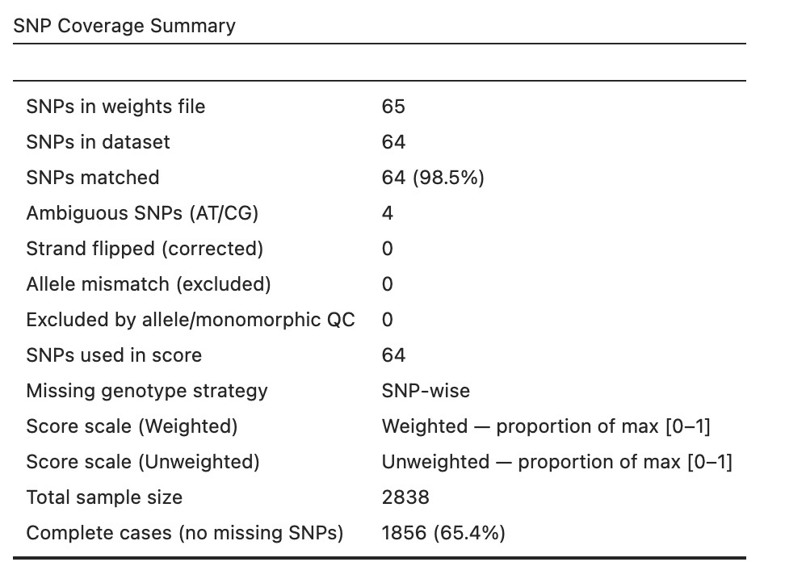
*Figure 20. SNP Coverage Summary table for an example PGS Catalog score. Metadata rows are shown only when the weights file includes a header.*

---

### Scoring options

#### Missing genotype handling

The **Missing genotype handling** dropdown specifies how missing genotypes are treated when computing the weighted sum:

| Strategy | Description |
|----------|-------------|
| Use observed SNPs only (SNP-wise) | Each individual is scored using only their observed SNPs; score is automatically adjusted for coverage (default) |
| Mean imputation | Missing dosage is replaced by the SNP's observed mean dosage across all individuals |
| Treat as 0 | Missing dosage is set to 0 (equivalent to assuming the reference homozygote) |
| Exclude individuals | Any individual with at least one missing genotype across the scoring SNPs is excluded from all analyses |

#### Correct for missing genotypes

Enable **Correct for missing genotypes** to divide each individual's raw weighted sum by their per-individual theoretical maximum — the sum of effect weights for SNPs with observed genotypes only. This correction removes the downward bias introduced when some SNPs are missing: an individual typed at 90% of SNPs should not receive a lower score simply because 10% are unobserved. The correction is strongly recommended when the *proportion* or *percent* rescaling methods are used, as those methods are only valid when the denominator reflects the individual's actual coverage.

#### Score rescaling

The **Score rescaling** dropdown applies a transformation to the (optionally corrected) score:

| Method | Formula | Typical use |
|--------|---------|------------|
| None | Raw weighted sum | When downstream software expects raw allele-count units |
| Proportion | Score / theoretical max → [0, 1] | Comparable across scores with different numbers of SNPs |
| Percent | Score / theoretical max × 100 → [0–100] | Human-readable proportion |
| Multiply | Score × user factor | Arbitrary scaling (e.g. per 10 risk alleles) |
| Per N alleles | Score / N | Expresses the score as a per-allele average |

For *Multiply* and *Per N alleles*, the **Scale factor / N alleles** field sets the multiplier or the N.

#### Standardize score (SD = 1)

Enable **Standardize score** to divide the final score by its sample standard deviation. The resulting score has SD 1 (the mean is left unchanged, not centred to 0), placing weighted and unweighted scores on a common standard-deviation scale and enabling OR and β estimates from the association table to be interpreted as "per-SD" effect sizes.

---

### PGS Summary Statistics

The **PGS Summary Statistics** table (Figure 21) is shown by default whenever at least one SNP is successfully scored; it can be hidden with the **Show PGS summary statistics** switch. For each score type (Weighted, Unweighted, or both), it reports descriptive statistics of the score distribution: N, mean, SD, 95% confidence interval of the mean, minimum, maximum, and skewness. When **Stratify summary by response** is enabled (the default) and a binary or categorical response variable is assigned, separate rows are shown for each outcome group plus an overall row; disable it, or use a continuous response, for a single overall row per score type.

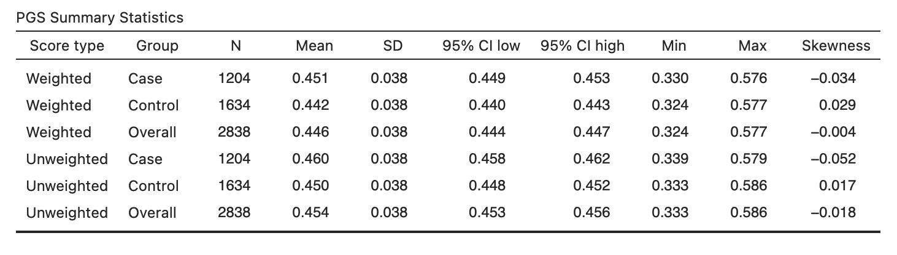
*Figure 21. PGS Summary Statistics table showing descriptive statistics of the score distribution overall and by case/control group.*

---

### Save PGS scores to data

Open the **Save** section at the bottom of the options panel to write the computed scores back to the jamovi dataset as new continuous columns — one per active weighting mode, named `PGS_Weighted` and/or `PGS_Unweighted`. Once saved, these columns are available to every other jamovi module for additional analyses — for example, as a predictor in a linear model or as an outcome in a mediation analysis. Scores are aligned to the correct original rows even when the *Exclude individuals* missing-genotype strategy is active and some rows were dropped during scoring.

---

### Analysis sub-sections

The three analysis sub-sections are enabled independently and require a response variable to be assigned. All analyses operate on complete cases with respect to the PGS score, the response, and any covariates.

#### PGS – response association

Enable **PGS – response association test** to regress the response on the PGS score (Figure 22). The set of tests run depends on the response type detected automatically from the data:

**Binary response** (two levels): logistic regression reporting the OR per unit PGS, Welch two-sample t-test of PGS means between cases and controls (reporting the mean difference), and Mann–Whitney U test (reporting the Hodges–Lehmann estimator of the location shift).

**Continuous response**: linear regression reporting the slope (β) and standard error, Pearson correlation (r), and Spearman rank correlation (ρ). For Spearman correlation, 95% confidence intervals are computed from the Fisher z-transformation.

**Polytomous response** (more than two levels): multinomial logistic regression (via `nnet::multinom`) with one OR row per non-reference level relative to the lowest level, plus an overall likelihood ratio test across all levels; one-way ANOVA (F statistic); and Kruskal–Wallis test (χ²).

When covariates are assigned, the regression models adjust for them; parametric tests are unadjusted. Table notes identify the response coding and the covariates included.

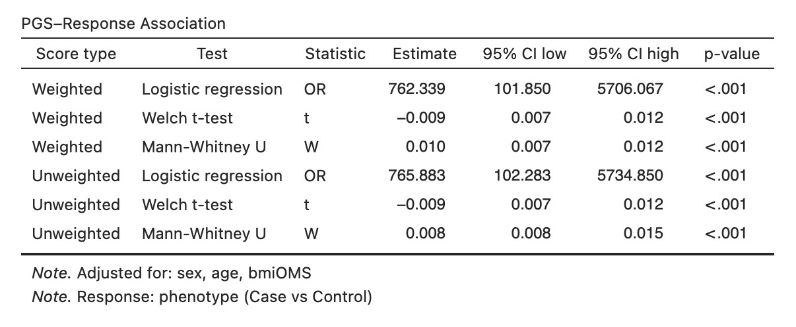
*Figure 22. PGS–response association table. For a binary response the table shows the logistic regression OR, the t-test mean difference, and the Mann–Whitney location-shift estimate, each with 95% CI and p-value.*

#### PGS percentile category analysis

Enable **Show percentile ranks** to divide the score distribution into percentile-defined categories and analyse outcomes across them (Figure 23).

The **Percentile thresholds** field accepts a comma-separated list of percentile cut-points (e.g. `20,40,60,80,90,95`), which define N+1 categories labelled `<P20`, `P20–P40`, …, `>P95`. Any values outside the 0–100 range or duplicate values are silently dropped; if the field is left blank, the default cut-points 20, 40, 60, 80, 90, and 95 are used.

The **Reference category** dropdown selects which category serves as the baseline in regression models: lowest, highest, or middle (the category containing the sample median; default).

Two tables are produced:

**PGS Percentile Category Counts** (Figure 23, left) shows, for each category: the score range observed within it, overall N (%), and — when a binary or polytomous response is selected — a column for each outcome level.

**PGS Percentile Category Analysis** (Figure 23, right) runs a regression of the response on the category factor. For a binary response, logistic regression yields ORs with 95% CI and p-value for each non-reference category. For a continuous response, linear regression yields mean differences (β). The reference category is marked with a ◆ symbol and its estimate is fixed to 1 (binary) or 0 (continuous). Covariates are included in the regression model when assigned.

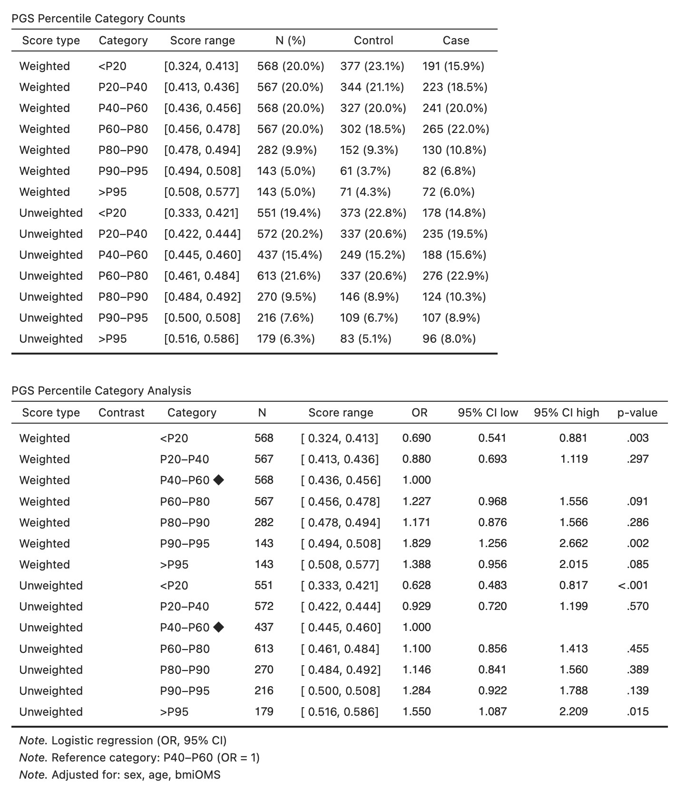
*Figure 23. Percentile category counts (left) and category analysis (right). Each row corresponds to one score percentile band. The reference category (◆) has OR = 1 by definition.*

#### PGS × covariate interaction

Enable **PGS × covariate interaction** to test whether the PGS effect on the response differs across levels of the **first covariate** in the covariate list (Figure 24). At least one covariate and a response variable must be assigned for this option to be enabled.

The interaction model is:

$$
g(\mu) = \beta_0 + \beta_{\text{PGS}} \cdot \text{PGS} + \beta_Z \cdot Z + \beta_{\text{PGS} \times Z} \cdot (\text{PGS} \times Z)
$$

where $g$ is the logit link for binary outcomes and the identity link for continuous outcomes. Additional covariates beyond the first are included as additive adjustment terms.

The table reports estimates (OR for binary, β for continuous) with 95% CI and p-value for: the PGS main effect, the first covariate's main effect (one row per non-reference level if categorical), and each PGS × covariate product term. A likelihood ratio test comparing the full interaction model against the main-effects-only model is reported in the final row. A table note lists any additional adjustment covariates.

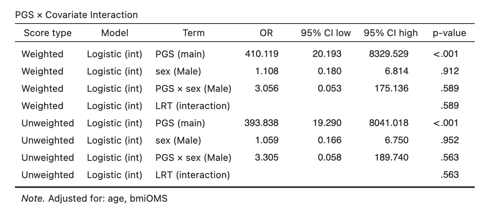
*Figure 24. PGS × covariate interaction table. The table reports the PGS and covariate main effects and each interaction product term from the same regression model, together with the overall LRT p-value for the interaction.*

---

### Plots

Enable individual plots in the *Plots* section to visualise score distributions and model performance. For a binary or categorical response, the **Case / event level** dropdown selects which response level is treated as the case/event — the positive class for the ROC and calibration curves and the reference group for the distribution colours; leaving it empty uses the last observed level.

#### Score distribution plot

Enable **Show score distribution plot** to visualise the PGS distribution (Figure 25). The **Plot type** dropdown offers three options:

- **Histogram** — a density-scaled histogram; the number of bins is set by the **Histogram breaks** field.
- **Density** — a kernel density estimate with a filled polygon and a boundary line.
- **Both** — overlays the density curve on the histogram bars.

When a binary response variable is assigned, separate distributions are drawn for each outcome group using distinct colours, a legend identifies the groups, and a Mann–Whitney p-value (two-sided) comparing the two distributions is annotated above the plot.

When a **continuous response** is assigned, an additional **PGS vs Response** scatter plot is produced showing the raw data points with an ordinary least-squares regression line, R², and p-value annotated.

Dashed vertical lines mark the group means in every panel.

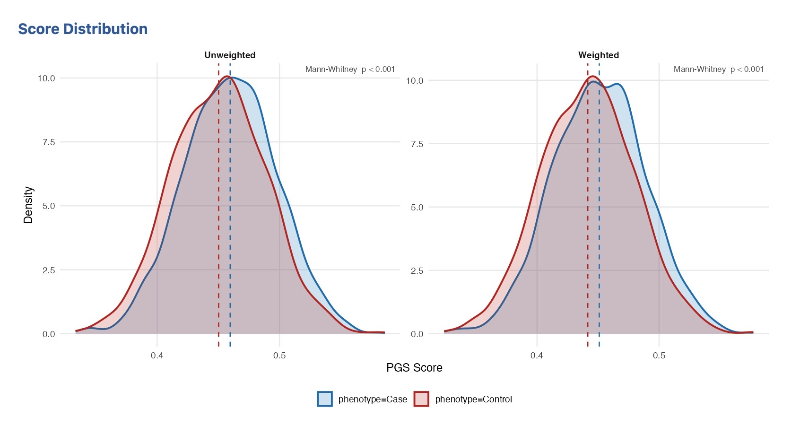
*Figure 25. Score distribution plot (histogram + density overlay) for a binary outcome. The two groups are shown in different colours, and the Mann–Whitney p-value is displayed above the plot.*

#### Percentile forest plot

Enable **Show percentile forest plot** to display ORs (binary response) or β coefficients (continuous response) per percentile category as a forest plot, using the same model and reference category as the percentile category analysis (Figure 26). The reference category is drawn as a filled diamond fixed at OR = 1 (or β = 0); the remaining categories show the point estimate with 95% CI whiskers. When covariates are assigned the model is adjusted for them, and a subtitle lists them. Requires a response variable to be assigned.

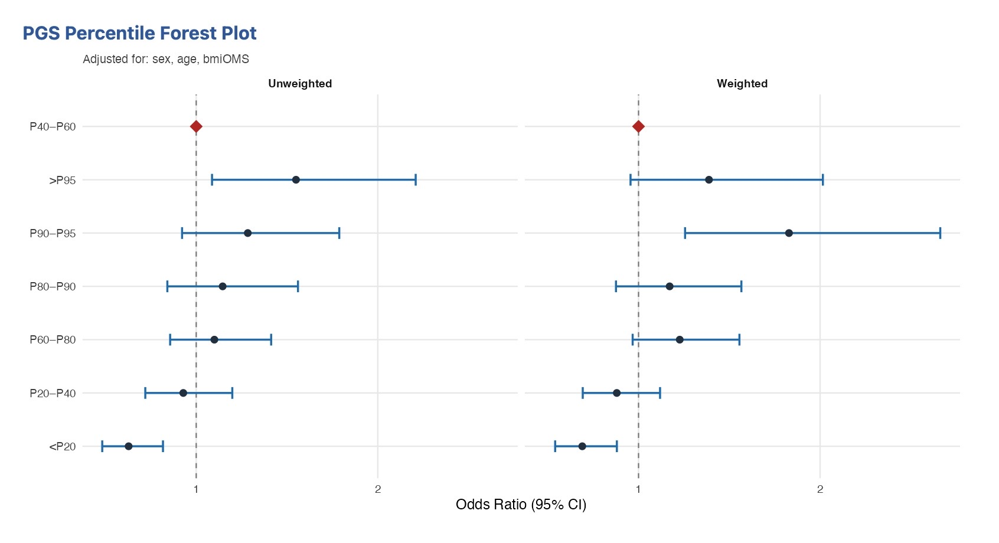
*Figure 26. Percentile forest plot for a binary outcome, adjusted for covariates. Each row is a score percentile band; the reference band (◆) is fixed at OR = 1.*

#### ROC curve

Enable **Show ROC curve** to display a Receiver Operating Characteristic curve with the area under the curve (AUC), computed via the trapezoidal rule (Figure 27). The PGS-only curve is always drawn; when covariates are assigned, two further curves are overlaid for comparison — **PGS + covariates** and **covariates only** — each with its own AUC. Requires a categorical response: for a binary response one curve set is shown; for a polytomous response each non-reference level is drawn against the reference in its own panel.

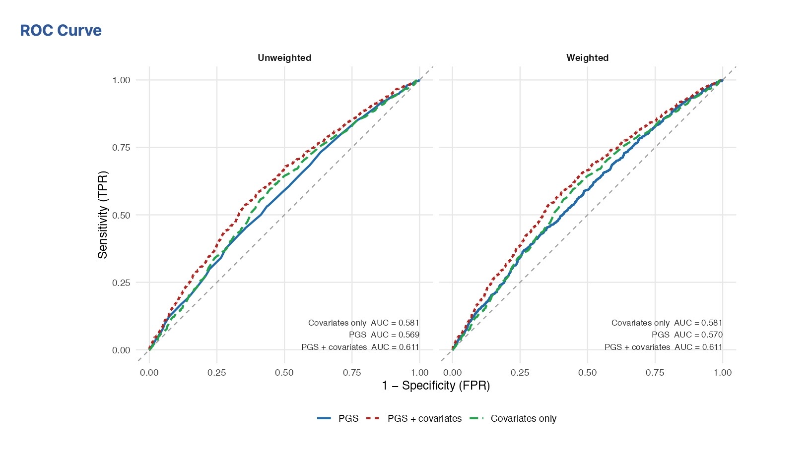
*Figure 27. ROC curves for a binary outcome comparing the PGS-only, PGS + covariates, and covariates-only models, each annotated with its AUC.*

#### Calibration plot

Enable **Show calibration plot** to display a calibration plot (Figure 28). Individuals are binned into deciles of predicted probability from the logistic model; the observed event rate per decile is plotted against the mean predicted probability, with the diagonal marking perfect calibration. A Hosmer–Lemeshow chi-square statistic is annotated. Requires a categorical response (binary, or each non-reference level of a polytomous response).

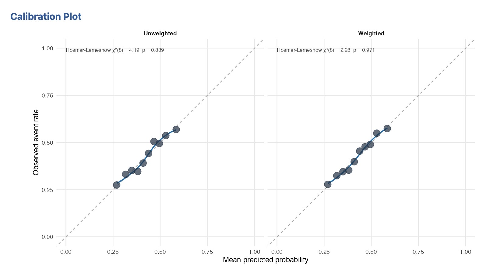
*Figure 28. Calibration plot for a binary outcome: observed vs predicted event rate by decile of predicted probability, with the Hosmer–Lemeshow statistic annotated.*

When both Weighted and Unweighted scoring modes are active, every plot shows each mode in a separate side-by-side panel within the same figure.

---

## References

Sole X, Guino E, Valls J, Iniesta R, Moreno V (2006). SNPStats: a web tool for the analysis of association studies. *Bioinformatics* 22(15):1928–1929.

Daniel S, Sinnwell J (2026). haplo.stats: Statistical Analysis of Haplotypes with Traits and Covariates when Linkage Phase is Ambiguous. R package version 1.9.8.3, https://CRAN.R-project.org/package=haplo.stats.

## Acknowledgments

This project has received funding from Consortium for Biomedical Research in Epidemiology and Public Health (CIBERESP), action Genrisk
